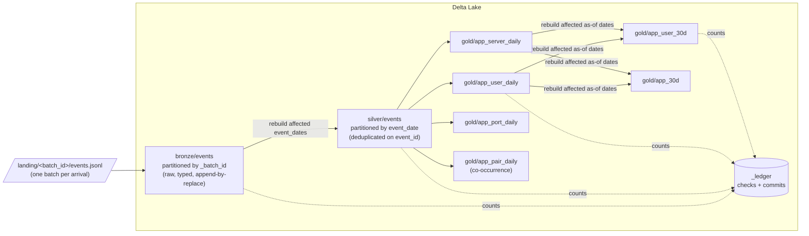

# delta-lakehouse-pipeline

[](https://github.com/VivekReddy2001/delta-lakehouse-pipeline/actions/workflows/ci.yml)


A PySpark + Delta Lake pipeline that turns raw zero-trust access telemetry
into **daily behavioural aggregates** and **rolling 30-day feature sets** for
a downstream model. It stays correct under the conditions that silently
break most batch pipelines:

| Condition | What goes wrong naively | What this pipeline does |
|---|---|---|
| A job is **retried** after a failure | Appends run twice → counts double | Every derived write *replaces whole partitions* recomputed from the layer below, so a retry rewrites identical rows |
| It **crashes halfway** (after silver, before gold) | Layers disagree until someone notices | The batch is only marked committed after reconciliation, so the next run redoes it end to end |
| Events arrive **days late** | Old daily aggregates and 30-day windows stay wrong forever | The pipeline finds every event date a batch touches and every 30-day window covering those dates, and rebuilds exactly those partitions |
| The transport **redelivers** events | The same access is counted twice | Silver keeps one row per `event_id` (the earliest batch wins, so the result is deterministic) |
| A landed file is **changed after being processed** | History is quietly rewritten | Each batch is fingerprinted, and a committed batch id with different content is refused |
| Data is **lost or tampered with** between layers | Features drift and nobody knows | Record counts are reconciled bronze → silver → gold for every touched partition, and every check is written to a ledger |

These properties are tested against real Delta tables. The strongest test
checks that **processing the batches in a random order produces
byte-for-byte the same gold tables as processing them in order**, and that
a crash at any of five stages followed by a retry gives the same result as
a clean run.

### A real run

Six days of telemetry, 1,000 events a day. The third batch is killed
halfway through, and the next run picks it up:

```text
$ python -m lakehouse generate --days 6 --events-per-day 1000
landed 6 batches in lake/landing: 2026-01-01 .. 2026-01-06

$ python -m lakehouse run --batch 2026-01-01 --batch 2026-01-02
{"batch": "2026-01-01", "status": "committed", "rows_in": 948, "affected_dates": ["2026-01-01"], ...}
{"batch": "2026-01-02", "status": "committed", "rows_in": 970, "affected_dates": ["2026-01-01", "2026-01-02"], ...}

$ python -m lakehouse run --batch 2026-01-03 --crash-after gold_daily
lakehouse.pipeline.SimulatedCrash: simulated crash after gold_daily

$ python -m lakehouse run
{"batch": "2026-01-03", "status": "committed", "rows_in": 999, "affected_dates": ["2026-01-01", "2026-01-02", "2026-01-03"], ...}
{"batch": "2026-01-04", "status": "committed", "rows_in": 1013, ...}
{"batch": "2026-01-05", "status": "committed", "rows_in": 1021, ...}
{"batch": "2026-01-06", "status": "committed", "rows_in": 1164, ...}

$ python -m lakehouse run
nothing to do: every landed batch is committed

$ python -m lakehouse reconcile
31 checks passed across 6 dates

$ python -m lakehouse show
bronze/events                 6,115 rows
silver/events                 6,000 rows      <- exactly 6 x 1,000: all 115 redeliveries removed
gold/app_user_daily           2,773 rows
gold/app_server_daily           463 rows
gold/app_port_daily             355 rows
gold/app_pair_daily             212 rows
gold/app_user_30d             4,134 rows
gold/app_30d                    240 rows
```

The batch that arrived on 2026-01-03 held events from three different days,
and all three days' partitions were rebuilt.

---

## Architecture



### One batch, step by step

`Pipeline.process_batch(batch_id)` in [`lakehouse/pipeline.py`](lakehouse/pipeline.py):

1. **Ledger check.** If the batch is already committed with the same content
   hash, skip it. If the hash differs, raise `BatchConflictError`.
2. **Bronze.** Read the batch, type it, and write it with
   `replaceWhere _batch_id = '<id>'`. A retry overwrites the partial copy
   left by a crash.
3. **Affected dates.** Collect the distinct `event_date`s in this batch.
   With late data, that is often several days.
4. **Silver.** For those dates only, recompute from *all* bronze rows,
   dedupe on `event_id`, and `replaceWhere event_date IN (...)`.
5. **Gold daily.** Recompute the four feature families for those dates.
6. **Gold rolling.** The affected as-of dates are every date `d + 0..29`
   for each affected `d` that exists in silver. Rebuild those 30-day
   windows from the daily tables.
7. **Reconcile.** Run the checks below. If any fails, record the failure
   and raise `ReconciliationError` *without* committing.
8. **Commit.** Append every check and a `commit` row with the content
   hash to the ledger.

No derived table is ever appended to, so a retry cannot add rows. The only
append-only table is the ledger, which is a log by design.

### Reconciliation checks (per affected partition)

| Check | Expected | Actual |
|---|---|---|
| `silver_unique_event_id` | 0 | duplicate `event_id`s in silver |
| `silver_vs_bronze` | distinct `event_id`s in bronze for the date | silver rows for the date |
| `app_user_daily_vs_silver` (and `app_server`, `app_port`) | silver rows for the date | Σ `events` in the gold table |
| `app_user_30d_vs_silver` | silver rows in the 30-day window | Σ `events_30d` at that as-of date |

Each daily gold table is *additive*: every silver event lands in exactly
one row. That is what makes an exact count check possible, rather than a
tolerance.

---

## Feature families

| Table | Grain | Columns |
|---|---|---|
| `app_user_daily` | date × app × user | events, bytes, blocked, first_seen, last_seen |
| `app_server_daily` | date × app × server | events, bytes, distinct_users |
| `app_port_daily` | date × app × port × protocol | events, bytes |
| `app_pair_daily` | date × app_a × app_b | windows, distinct_users |
| `app_user_30d` | as-of date × app × user | active_days, events_30d, bytes_30d, blocked_30d, last_seen |
| `app_30d` | as-of date × app | distinct_users_30d, distinct_servers_30d, events_30d |

### Co-occurrence and why it needs pruning

`app_pair_daily` counts pairs of applications the same user touched within
the same hour. The number of pairs is quadratic in apps per user-hour. A
single scanner touching 300 apps in an hour would emit ~45,000 pairs, more
than all genuine traffic. Two rules keep it tractable:

- **`max_apps_per_window` (default 10).** Only a user's K busiest apps in a
  window take part. Ties are broken by app id, so results are
  deterministic.
- **`min_support` (default 2).** A pair must co-occur in at least this many
  user-hour windows that day.

Both trade recall of rare true pairs for a bounded table. The unit tests
pin the exact behaviour (`test_pair_pruning_caps_apps_per_window`,
`test_pair_min_support`).

---

## The data

Real access logs are private, so
[`lakehouse/generate.py`](lakehouse/generate.py) produces deterministic
synthetic telemetry with the properties that matter:

- **skew:** Zipf-like app popularity and Pareto-distributed user activity;
- **late arrival:** 5% of events land 1–4 days after they happened;
- **redelivery:** 2% of events are sent again in the next batch;
- **a stable topology:** each app has fixed servers and ports, and each
  user a fixed set of apps, so the features have real structure.

```json
{"event_id":"3f1c…","event_time":"2026-01-03T14:07:21Z","user_id":"user-0042","app_id":"app-007",
 "server_ip":"10.0.7.2","port":5432,"protocol":"TCP","bytes_sent":2214,"bytes_recv":8801,"action":"allow"}
```

---

## Quick start

Requires Python 3.10+ and Java 17 or newer (Spark 4).

```bash
pip install -e ".[dev]"

python -m lakehouse generate --days 10          # land 10 daily batches
python -m lakehouse run                          # process everything pending
python -m lakehouse show                         # row counts + ledger
python -m lakehouse reconcile                    # re-verify every partition

# see recovery for yourself
python -m lakehouse generate --days 10
python -m lakehouse run --batch 2026-01-01 --crash-after silver   # dies mid-batch
python -m lakehouse run                                           # redoes it, then the rest
python -m lakehouse run                                           # "nothing to do"
```

Or with Docker:

```bash
docker compose run --rm generate
docker compose run --rm pipeline
docker compose run --rm pipeline show
```

## Tests

```bash
pytest
```

| Test | Guarantee |
|---|---|
| `test_matches_independent_count` | Gold totals equal a plain-Python count of distinct landed events |
| `test_rerun_is_a_noop` | Re-running committed batches skips them and changes nothing |
| `test_crash_then_retry_equals_clean_run[×5]` | A crash after bronze / silver / gold_daily / gold_rolling / reconcile, then a retry, equals a clean run |
| `test_order_independence` | Shuffled batch order → identical silver and gold |
| `test_late_batch_rewrites_only_affected_partitions` | A late event touches only its day, and exactly the 30-day windows covering it |
| `test_relanded_batch_with_new_content_is_refused` | Changed content under a committed batch id raises |
| `test_reconciliation_catches_silent_loss` | Deleting silver rows behind the pipeline's back is detected |
| `test_ledger_records_every_check` | Every check and commit is logged |
| `test_features.py` | Dedup, co-occurrence windows, pruning, support, 30-day window boundaries, generator determinism |

## Project layout

```text
lakehouse/
  generate.py   synthetic telemetry with late + redelivered events
  features.py   pure DataFrame transforms (bronze -> silver -> gold)
  tables.py     table paths and the single replace_partitions() write primitive
  pipeline.py   ledger, partition-scoped rebuilds, reconciliation, recovery
  spark.py      SparkSession with Delta configured
  cli.py        generate / run / reconcile / show
tests/          end-to-end and unit tests on real Delta tables
```

## Design notes and limitations

- **Why partition replacement rather than `MERGE`?** A `MERGE` of
  aggregates is idempotent only if the aggregate is recomputed in full for
  every key it touches, which amounts to partition replacement anyway, with
  more room for error. Replacing whole partitions makes "same input → same
  output" hold by construction and keeps the reconciliation checks exact.
- **Bronze is partitioned by batch, silver by event date.** Rebuilding a
  silver date reads bronze filtered on `event_date`. That column is not
  bronze's partition key, so Delta relies on its per-file min/max
  statistics to skip files. At larger scale, Z-ordering bronze on
  `event_date` or adding it as a second partition column would make this
  cheaper.
- **The ledger is append-only and small.** In production it would also feed
  alerting on `failed` rows.
- Runs on a local Spark session. The code has no local-only assumptions,
  but it has not been benchmarked on a cluster.

## License

MIT, see [LICENSE](LICENSE).
